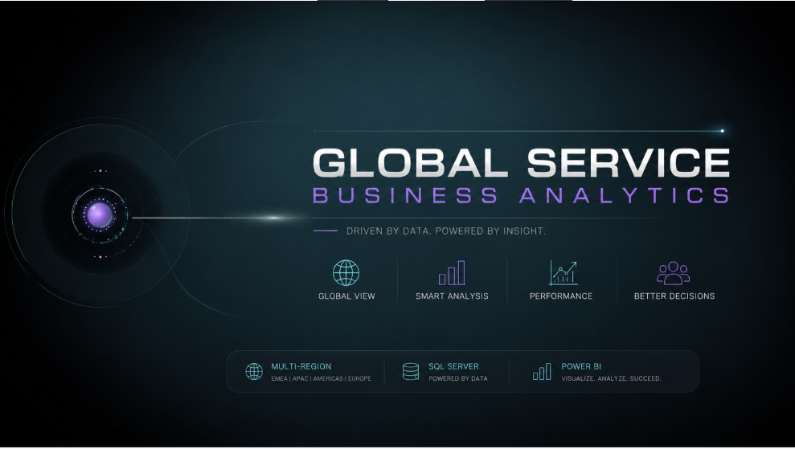
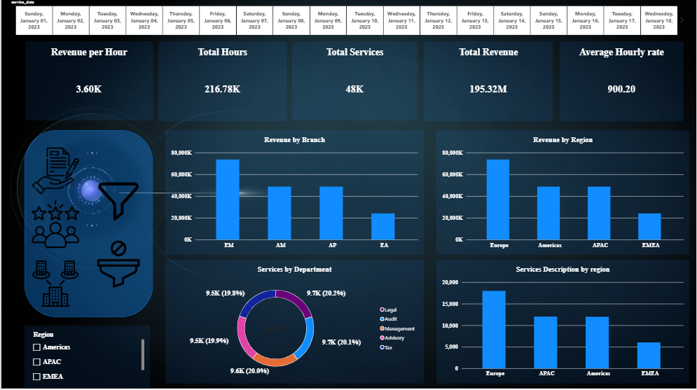
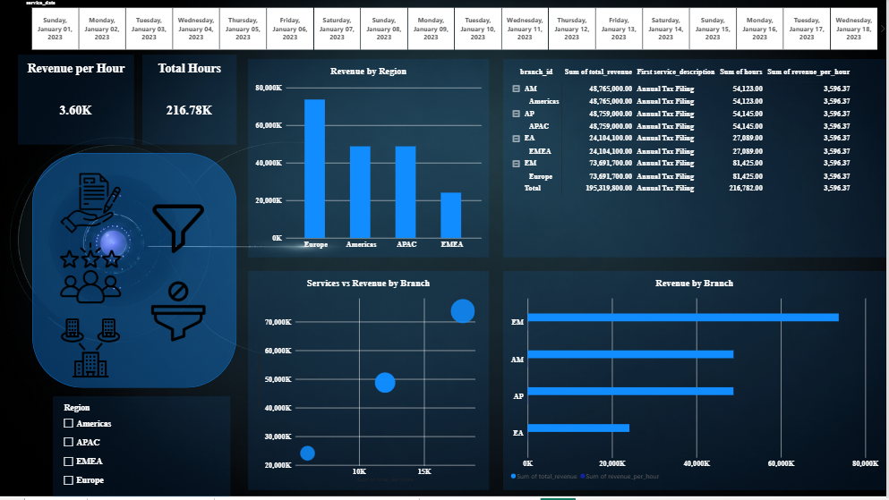
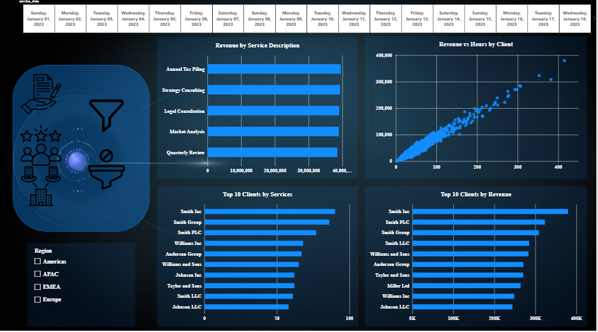

# 🌍 Global Service Business Analytics



## 📌 Project Overview

**Global Service Business Analytics** is an end-to-end data analytics project focused on analyzing global service operations, branch performance, revenue, working hours, clients, departments, countries, and regions.

The project uses **SQL Server and T-SQL** to transform raw service data into structured analytical Views, which are then used as the foundation for **Power BI** dashboards and business analysis.

The solution is designed to answer practical business questions and provide management with a clear view of service performance across different branches, countries, and regions.

---

# 🎯 Business Objective

The main objective of the project is to transform raw operational service data into meaningful business insights that support performance monitoring and business decision-making.

The analysis focuses on questions such as:

* Which branches generate the highest revenue?
* Which countries and regions contribute the most revenue?
* How many services have been delivered?
* How many working hours have been generated?
* What is the average hourly rate?
* How much revenue is generated per service hour?
* Which departments and services generate the highest revenue?
* Which clients contribute the most revenue?
* How does performance vary between branches and regions?
* Which clients have the highest service and revenue contribution?

---

# 🗂️ Dataset

The analysis is based on two main SQL Server tables.

## `services_data`

Contains detailed information about delivered services:

* `service_id`
* `service_type_id`
* `client_name`
* `hours`
* `service_date`
* `service_time`
* `hourly_rate`
* `total_revenue`
* `branch_id`
* `department`
* `service_description`

## `Branch_data`

Contains branch and geographic information:

* `Branch_ID`
* `Country`
* `Region`

### 🔗 Relationship

The two tables are connected through the branch identifier:

```text
services_data.branch_id
        ↓
Branch_data.Branch_ID
```

This relationship allows service-level information to be analyzed together with branch, country, and regional information.

---

# 🛠️ Tools & Technologies

* **SQL Server**
* **T-SQL**
* **Microsoft Power BI**
* **Data Preparation**
* **Data Transformation**
* **Data Modeling**
* **KPI Analysis**
* **Business Intelligence**
* **Data Visualization**
* **SQL Analytical Views**

---

# 🧠 SQL Analysis

SQL Server was used to build reusable analytical Views that organize the raw data into business-oriented datasets.

Instead of repeatedly performing calculations directly on the raw tables, the project creates dedicated Views for different analytical areas.

---

## 1️⃣ Service Details Analysis

### `vw_Service_Details`

This View combines service-level information with branch and geographic information.

It includes:

* Service ID
* Client
* Hours
* Service Date
* Service Time
* Hourly Rate
* Total Revenue
* Department
* Service Description
* Branch
* Country
* Region

### Purpose

The View creates a unified service-level dataset that can be used for detailed analysis and Power BI reporting.

---

## 2️⃣ Branch Performance Analysis

### `vw_Branch_Performance`

This View measures the operational and financial performance of each branch.

### Key Metrics

* Total Services
* Total Hours
* Total Revenue
* Average Hourly Rate
* Revenue per Hour

### Revenue per Hour

```sql
SUM(s.total_revenue) / NULLIF(SUM(s.hours), 0)
```

Revenue per Hour provides a measure of revenue generated relative to the number of service hours delivered.

---

## 3️⃣ Service Performance Analysis

### `vw_Service_Performance`

This View analyzes service performance by:

* Department
* Service Description

### Key Metrics

* Total Services
* Total Hours
* Total Revenue
* Average Hourly Rate

This allows the analysis to compare different services and departments based on their operational activity and revenue contribution.

---

## 4️⃣ Client Performance Analysis

### `vw_Client_Performance`

This View analyzes client contribution across countries and regions.

### Key Metrics

* Total Services
* Total Hours
* Total Revenue
* Country
* Region

A Top 10 client analysis is also performed using total revenue:

```sql
SELECT TOP 10 *
FROM vw_Client_Performance
ORDER BY total_revenue DESC;
```

This provides a focused view of the clients with the highest revenue contribution.

---

# 📊 Power BI Dashboard

The SQL analytical Views provide the structured data layer used for the Power BI dashboard.

The dashboard focuses on four main analytical areas:

### 💰 Revenue Performance

* Total Revenue
* Revenue by Branch
* Revenue by Country
* Revenue by Region
* Revenue per Hour

### 🏢 Branch Performance

* Total Services
* Total Hours
* Total Revenue
* Average Hourly Rate
* Revenue per Hour

### 🛠️ Service Performance

* Services by Department
* Revenue by Service
* Hours by Service
* Average Hourly Rate

### 👥 Client Performance

* Total Clients
* Client Revenue
* Client Services
* Client Hours
* Top Clients by Revenue

---

# 📸 Dashboard Preview

## Executive Overview

The overview dashboard provides a high-level view of global service performance, including key operational and financial indicators.



---

## Branch Performance

The branch analysis provides a detailed comparison of branch performance across countries and regions.



---

## Client Performance

The client analysis focuses on service activity, working hours, and revenue contribution across clients.



---

# 🔍 Analytical Approach

The project follows a structured analytical approach:

```text
Raw Service Data
        ↓
SQL Server
        ↓
Data Preparation
        ↓
Table Relationships
        ↓
SQL Analytical Views
        ↓
Business Metrics
        ↓
Power BI
        ↓
Interactive Dashboard
        ↓
Business Insights
```

---

# 🧩 Analytical Hierarchy

The analysis allows business performance to be explored from a high-level perspective down to individual clients and services:

```text
Region
   ↓
Country
   ↓
Branch
   ↓
Department
   ↓
Service
   ↓
Client
```

This structure allows users to move from overall global performance to specific operational drivers.

---

# 📈 Key Performance Indicators

The project focuses on several important KPIs:

| KPI                     | Description                                     |
| ----------------------- | ----------------------------------------------- |
| **Total Revenue**       | Total revenue generated from delivered services |
| **Total Services**      | Number of services delivered                    |
| **Total Hours**         | Total service hours generated                   |
| **Average Hourly Rate** | Average rate charged per service hour           |
| **Revenue per Hour**    | Revenue generated relative to service hours     |

---

# 💡 Business Insights Framework

The dashboard is designed to support analysis around:

### What Happened?

* How much revenue was generated?
* How many services were delivered?
* How many hours were worked?
* Which branches generated the highest revenue?
* Which clients contributed the most revenue?

### Where?

* Which regions performed strongly?
* Which countries generated the most revenue?
* Which branches contributed most to regional performance?

### What Drives Performance?

* Which departments generate the most revenue?
* Which services contribute most to revenue?
* Which clients have the highest revenue contribution?
* How does Revenue per Hour vary across branches?

---

# 🗃️ SQL Views

The project contains four main analytical Views:

```text
vw_Service_Details
        ↓
Detailed service-level analysis

vw_Branch_Performance
        ↓
Branch and geographic performance

vw_Service_Performance
        ↓
Department and service analysis

vw_Client_Performance
        ↓
Client and regional performance
```

These Views separate SQL-based business logic from dashboard visualization and make the analytical layer easier to reuse.

---

# 📁 Project Structure

```text
Global_service/
│
├── README.md
│
├── cover.png
├── overview.png
├── branch.png
└── clients.png
```

---

# 🎯 Project Skills Demonstrated

This project demonstrates practical experience in:

* SQL
* T-SQL
* SQL Server
* Data Preparation
* Data Transformation
* Data Modeling
* SQL Views
* KPI Development
* Revenue Analysis
* Service Analysis
* Branch Performance Analysis
* Regional Analysis
* Country Analysis
* Client Analysis
* Department Analysis
* Operational Analysis
* Revenue per Hour Analysis
* Business Intelligence
* Power BI
* Data Visualization
* Dashboard Development
* Business Insights

---

# 💼 Business Value

This project demonstrates how raw operational data can be transformed into a structured business analytics solution.

By combining **SQL Server** for data preparation and analytical logic with **Power BI** for visualization, the solution provides multiple perspectives for understanding:

* Revenue performance
* Service activity
* Branch performance
* Regional performance
* Client contribution
* Department performance
* Service efficiency

The separation between SQL-based data preparation and Power BI visualization also provides a structured and reusable approach to business intelligence reporting.

---

# 👩‍💻 Author

**Aldrda Ali**
**Data Analyst**

### Profiles

* GitHub: `aldrda`
* LinkedIn: `aldrda-ali`
* Portfolio: `data-analyst.aldrda.workers.dev`

---

## ⭐ Project Focus

**SQL Server • T-SQL • Power BI • Data Analysis • Business Intelligence • KPI Analysis • Data Visualization • Dashboard Development**
